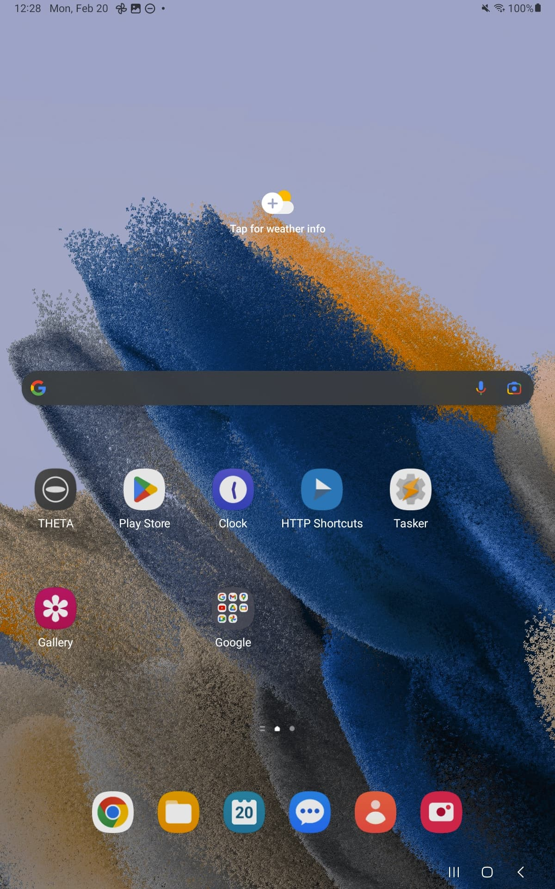
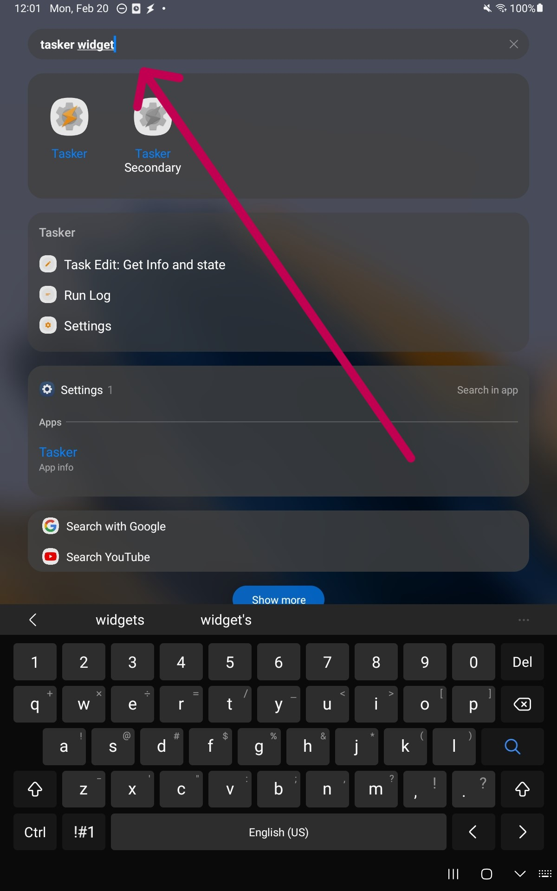
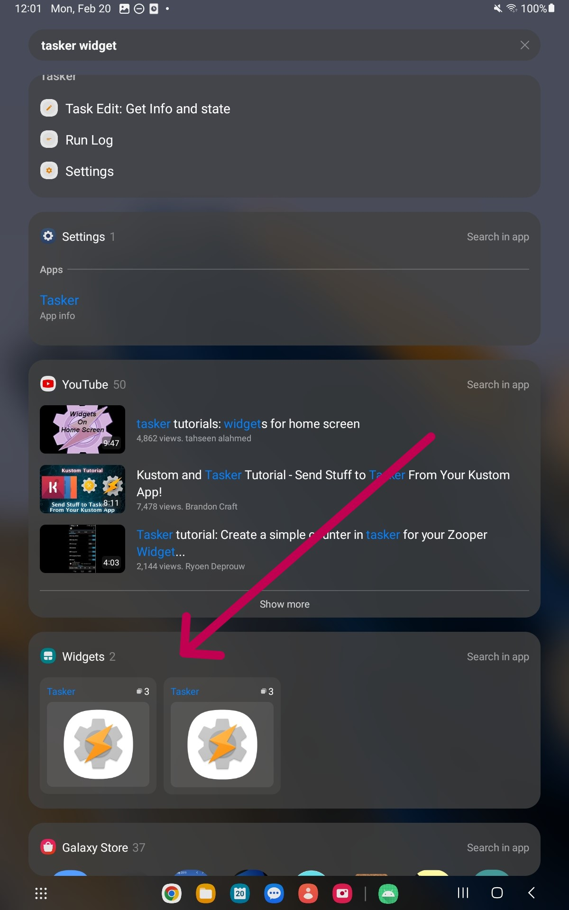
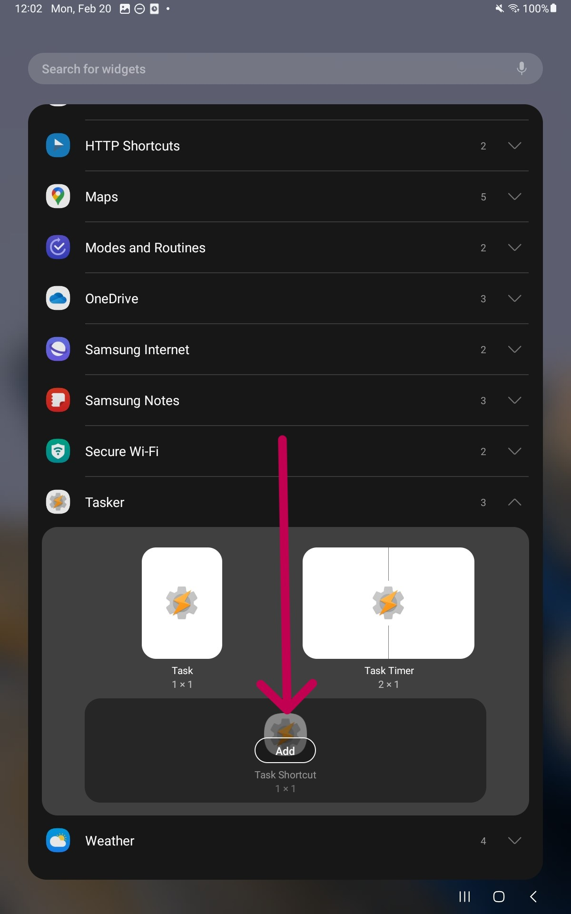
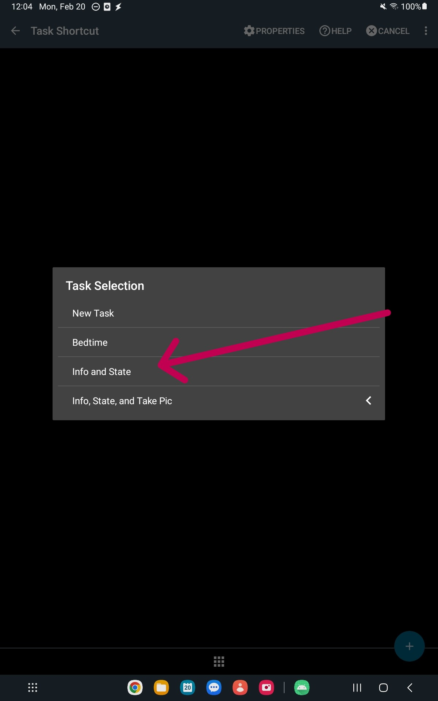
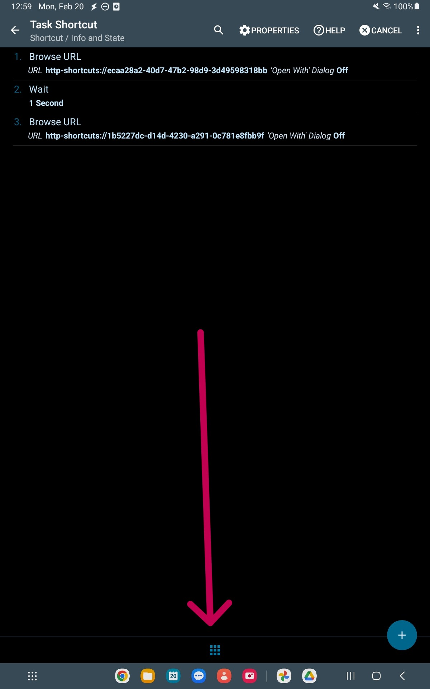
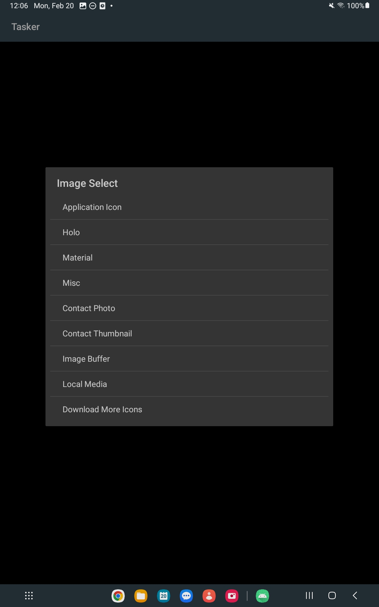
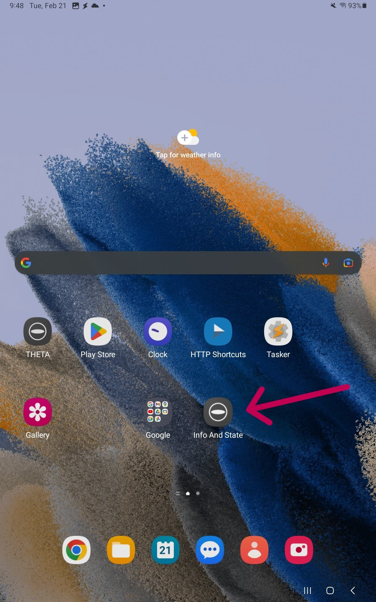
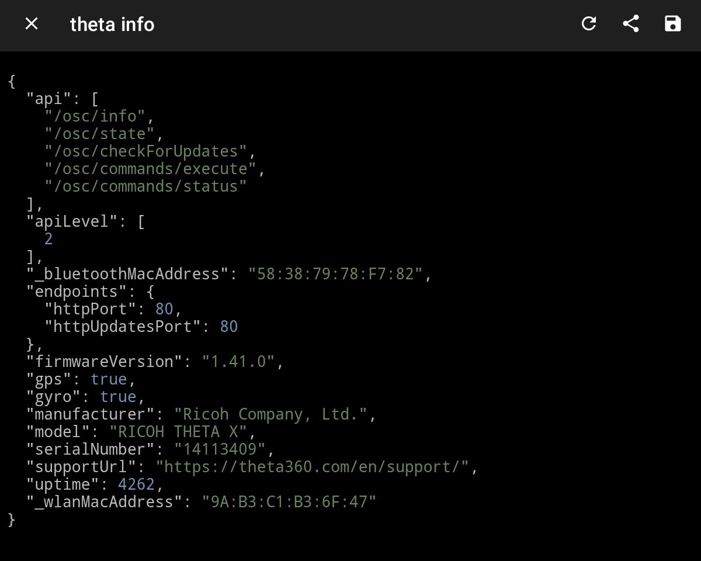
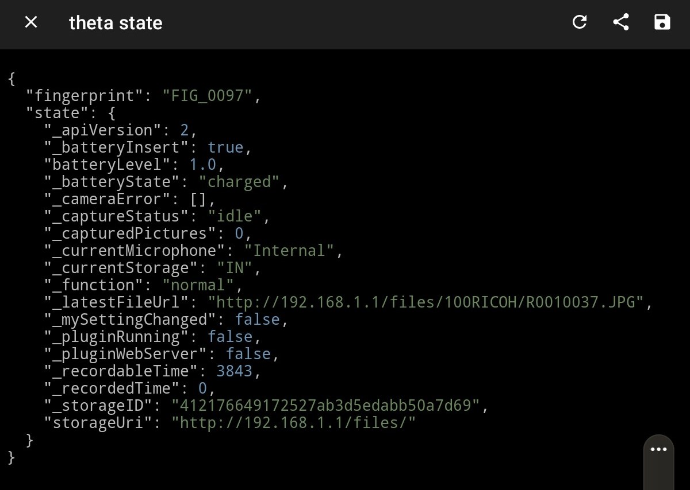

<svg role="img" fill="#3DDC84" viewBox="0 0 24 24" xmlns="http://www.w3.org/2000/svg" width="96px" height="96px" ><title>Android</title><path d="M17.523 15.3414c-.5511 0-.9993-.4486-.9993-.9997s.4483-.9993.9993-.9993c.5511 0 .9993.4483.9993.9993.0001.5511-.4482.9997-.9993.9997m-11.046 0c-.5511 0-.9993-.4486-.9993-.9997s.4482-.9993.9993-.9993c.5511 0 .9993.4483.9993.9993 0 .5511-.4483.9997-.9993.9997m11.4045-6.02l1.9973-3.4592a.416.416 0 00-.1521-.5676.416.416 0 00-.5676.1521l-2.0223 3.503C15.5902 8.2439 13.8533 7.8508 12 7.8508s-3.5902.3931-5.1367 1.0989L4.841 5.4467a.4161.4161 0 00-.5677-.1521.4157.4157 0 00-.1521.5676l1.9973 3.4592C2.6889 11.1867.3432 14.6589 0 18.761h24c-.3435-4.1021-2.6892-7.5743-6.1185-9.4396"/></svg>

In the **Android Home Screen**

1. Swipe Up and open up the Search Screen

    

2. Search for "*Tasker Widget*"

    

3. Scroll down until you see the "Widgets" category and Tasker should be in the category and Press on the first Tasker Icon you see.

    

4. Scroll down until you see the shortcut Tasker option and Add a Tasker Shortcut like shown

    

5. Select a Task to make into a Shortcut

    

6. Select an image icon by pressing the little 3x3 icon, their are many options to choose from. I chose the "Application Icon" from RICOH THETA

    

    

7. Press the Back arrow and now you should have a shortcut on your home screen!
 
    

    

    